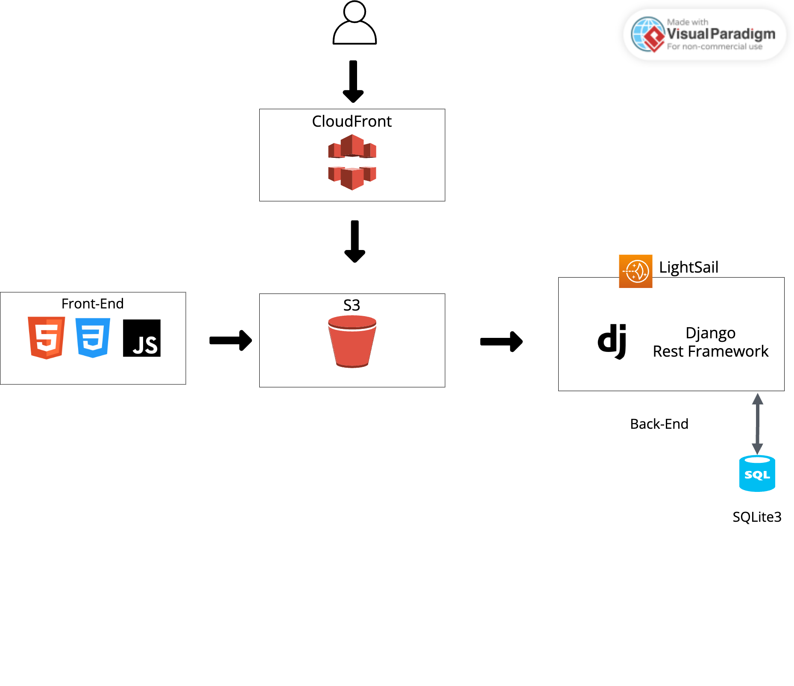
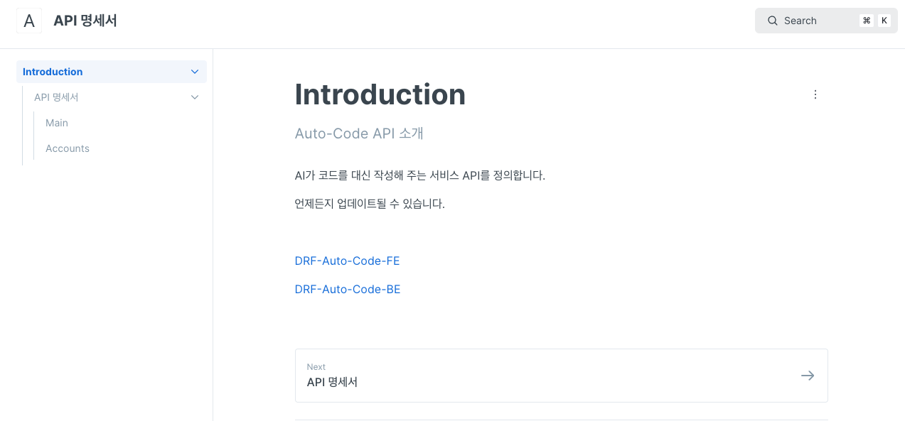
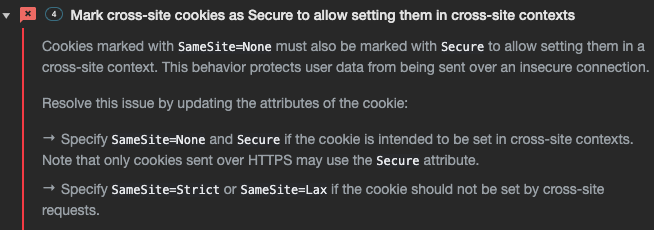

<div align='center'>

# DRF-Auto-Code

</div>
<div align="center">


<!-- [](https://hits.seeyoufarm.com) -->
</div>

## DRF-Auto-Code

- 1차 개발기간: 23.08.29 ~ 23.09.06 (9일)

- 2차 개발기간: 23.11.21 ~ 23.11.28 (8일)

---

## 목차 📝

1. [프로젝트 소개](#summary)

2. [배포 URL](#url)

3. [프로젝트 일정](#planning)

4. [요구사항 분석](#requirement)

5. [기술 스택 및 배포환경](#stack)

6. [프로젝트 구조](#tree)

7. [ERD 설계](#erd)

8. [상세 페이지 설명](#main-exe)

9. [겪었던 에러들](#errors)

10. [느낀점](#impression)

---

## <span id="summary"> 프로젝트 소개 🙇‍♂️

Auto-Coding은 AI가 코드를 대신 작성해 주는 서비스입니다.

이번 프로젝트는 이전 프로젝트에서 개발한<a href="https://github.com/HiImYong99/Auto-Generate-Code"> Auto-Coding</a>을 기반으로, 
Django REST Framework을 활용하여 회원가입, 로그인, 로그아웃 기능이 추가되었습니다. 

또한, OpenAI에서 제공하는 API를 이용하여 직접 만든 서버를 통해 요청하도록 했습니다.

유저들은 이제 각각의 요청값과 응답값을 데이터베이스에 안전하게 저장하고, 이를 통해 로그인한 본인만이 해당 정보를 확인할 수 있습니다.
  
이를 통해 보안과 개인 정보의 안전한 관리가 가능합니다.

---

## <span id="url">배포 URL 🔗

> **🔗 : <a href="http://d3n3wr5yyqfyke.cloudfront.net/index.html" target="_blank"> Auto Coding 바로가기</a>

```
해당 서비스를 이용할 수 있는 테스트 계정입니다.
ID : test1@gmail.com
PW : test2023
```
 - Front-End Repo: <a href="https://github.com/HiImYong99/DRF-Auto-Code-FE" target="_blank">DRF-Auto-Code-FE</a>
 

---

## <span id="planning"> 프로젝트 일정 🗓️

 

---

## <span id="requirement"> 요구사항 분석 🧐


<a href='#main-exe'>기능 시연 화면</a>

---

## <span id="stack">기술 스택 및 배포환경📚

### Environment


### Development

- #### FrontEnd


<br>

- #### BackEnd


- #### DB


- #### API


- #### 배포


<br>



---

## <span id="tree">프로젝트 구조 🏛️

### URL 구조🌐


#### main
|기능|URL|Method|비고|
|------|---|---|---|
|코드 요청|gpt/request/|POST|로그인 사용자만 가능, 1일 요청 최대 5회|
|기록 조회|gpt/response/|GET|사용자 본인의 기록만 조회 가능|
|기록 삭제|gpt/delete/\<int:pk>/|DELETE|사용자 본인의 기록만 삭제 가능|
|기록 전체 삭제|gpt/delete/all/|DELETE|사용자 본인의 기록만 삭제 가능|


#### accounts
|기능|URL|Method|비고|
|------|---|---|---|
|로그인|accounts/login/|POST|액세스 토큰과 리프레쉬 토큰을 제공|
|로그아웃|accounts/logout/|POST|액세스 토큰과 리프레쉬 토큰만료 (토큰 만료 시간 30분) |
|회원가입|accounts/register/|POST|액세스 토큰과 리프레쉬 토큰을 제공|
|토큰 재발급|accounts/token/refresh/|POST|리프레쉬 토큰을 통한 액세스 토큰 재발급 (사용자가 페이지를 새로고침할 때 재발급)|

### API 명세서 🧾



GitBook으로 작성되었습니다. - <a href="https://drf-auto-code.gitbook.io/api/">API 명세 바로가기</a>
 
### 폴더 트리🌳
``` tree
📦 DRF_Auto_Code

├─ 📂 DRF_Auto_Code - 프로젝트의 기본적인 세팅
│  ├─ __init__.py
│  ├─ asgi.py
│  ├─settings.py
│  ├─ urls.py
│  └─ wsgi.py
├─ 📂 accounts      - 회원관리(회원가입,로그인,로그아웃) API
│  ├─ __init__.py
│  ├─admin.py
│  ├─apps.py
│  ├─managers.py
│  ├─ migrations
│  ├─ models.
│  ├─tests.py
│  ├─ urls.py
│  └─ views.py
├─ 📂 main      - 메인서비스(GPT 요청 및 응답값 관리) API
│  ├─ __init__.py
│  ├─admin.py
│  ├─apps.py
│  ├─ migrations
│  ├─ models.py
│  ├─serializers.py
│  ├─tests.py
│  ├─ urls.py
│  └─ views.py
├─ manage.py
└─ requirements.txt
```

---

## <span id="erd"> ERD 설계 📀


---


## <span id="main-exe">상세 페이지 설명  🚨

### 메인 페이지

|               메인 페이지               |
| :-------------------------------------: |
|   |

#### ⭐️ 자동 코드 생성

- AI가 사용자의 요청을 기반으로 코드를 자동으로 생성합니다.

#### ⭐️ 회원관리

- 이메일과 비밀번호를 통한 회원가입 및 로그인을 할 수 있습니다.

#### ⭐️ 기록 관리

- 각 사용자가 서비스를 이용한 횟수, 가장 자주 사용한 언어와 기능을 확인할 수 있습니다.

- 또한 이전에 요청한 내용과 AI의 답변을 간편하게 조회하고 관리할 수 있습니다.


<br>

### 회원관리

<br>


|                회원가입               |
| :-------------------------------------: |
|  |

```
이메일과 비밀번호를 통한 회원가입 할 수 있습니다.

회원가입 로그인 완료 시 로그인 페이지로 이동합니다.
```

|                 로그인               |
| :-------------------------------------: |
|  |

```
이메일과 비밀번호를 통한 회원가입 및 로그인을 할 수 있습니다.

로그인 완료 시 메인페이지로 이동합니다.

로그인을 한 유저는 메인 서비스를 이용할 수 있습니다.
```

<br>

|                 로그아웃                 |
| :-------------------------------------: |
|   |

```
로그아웃 버튼을 통해 유저는 로그아웃을 할 수 있습니다.

로그아웃 완료 시 메인페이지로 이동합니다.
```

<br>

|                 자동 로그아웃                 |
| :-------------------------------------: |
|   |

```
사용자가 30분 동안 페이지 새로고침을 하지 않으면 사용자는 자동으로 로그아웃이 됩니다.

로그아웃 완료 시 메인페이지로 이동합니다.
```

<br>


### 메인 서비스

<br>


|              자동 코드 생성             |
| :----------------------------------: |
|   |

```
사용자가 선택한 option과 입력한 세부내용들을 요청버튼을 클릭하여 AI에게 데이터를 요청합니다.

이때 사용자가 요청 버튼을 클릭하면 요청한 내용들은 DB에 저장됩니다.

AI의 응답이 완료되면 응답 받은 내용을 html 문서에 출력합니다. 

이때 출력한 내용 또한 DB에 저장됩니다.
```

<br>

|              요청 횟수 제한             |
| :----------------------------------: |
|   |

```
사용자는 하루 최대 5건의 요청만 가능합니다.

하루 5건의 넘는 요청을 할 시 사용자에게 alert가 나타나며 AI의 응답은 출력되지 않습니다.
```

|              접근제한             |
| :----------------------------------: |
|   |

```
자동 코드 생성 서비스는 로그인을 한 유저만 사용 가능하며 

비회원 유저에게는 요청 버튼이 아닌 로그인 페이지로 이동하는 버튼이 나타납니다.
```

<br>

<br>

|      내 통계       |
| :-------------------------------------: |
|   |

```
메인 페이지를 벗어나지 않고 모달 창을 이용하여 편리하게 사용자의 통계를 확인할 수 있습니다.

위 통계는 각 사용자가 AI에게 요청할 때 저장된 DB를 통해 나타난 수치이며 로그인한 본인만 확인할 수 있습니다.
```

<br>

|               내 기록                |
| :------------------------------------: |
|   |

```
이전에 AI에게 요청했던 세부내용들과 AI에게 답변 받은 내용들은 '내 기록' 페이지에서 언제든지 확인할 수 있습니다.

위 기록 또한 사용자가 AI에게 요청할 때 입력한 내용과 AI가 답변할 때 DB에 저장된 내용을 기반으로 사용자들에게 보여집니다.

기록을 삭제하고 싶다면 삭제 아이콘을 클릭하여 원하는 데이터를 삭제하거나

기록초기화 버튼을 클릭하여 DB에 저장된 요청 관련 데이터들을 모두 삭제 시킬 수 있습니다.
```


<br>


---

## <span id="errors">겪었던 에러 😑

### 로컬환경 JWT 전달

#### 에러

API 테스트를 마친 뒤 FE와 연결하던 도중 문제가 발생했습니다.

로그인 완료 후 쿠키에 JWT 토큰이 저장되어야 하는데  토큰이 발급되자마자 쿠키가 전부 사라지는 이슈를 겪었습니다.

#### 원인

- 확인해 보니 CORS 에러가 발생 했습니다.

```
CORS는 

브라우저에서는 보안적인 이유로 cross-origin HTTP 요청들을 제한합니다. 그래서 cross-origin 요청을 하려면 서버의 동의가 필요합니다. 만약 서버가 동의한다면 브라우저에서는 요청을 허락하고, 동의하지 않는다면 브라우저에서 거절합니다.

이러한 허락을 구하고 거절하는 메커니즘을 HTTP-header를 이용해서 가능한데, 이를 CORS(Cross-Origin Resource Sharing)라고 부릅니다.
```

```
cross-origin
cross-origin이란 다음 중 한 가지라도 다른 경우를 말합니다.

프로토콜 - http와 https는 프로토콜이 다르다.
도메인 - domain.com과 other-domain.com은 다르다.
포트 번호 - 8000포트와 5500포트는 다르다.
```

- 따라서 클라이언트는 `localhost:5500` 외부 서버는 `localhost:8000`로 포트가 서로 달라서 CORS가 발생한 것 이였습니다.

#### 해결방법

- 외부 서버에서 보내는 요청의 헤더에 cross origin HTTP 요청을 허가하여 접근을 허락하는 내용을 추가하면 됩니다.
    - django-cors-headers 앱을 추가합니다. `pip install django-cors-headers`
    
    ```python
    INSTALLED_APPS = [
        ...
        'corsheaders',
        ...
    ]
    ```
    
    ```python
    MIDDLEWARE = [
        'corsheaders.middleware.CorsMiddleware', # <- 가능한 높게 위치시켜야 한다.
        'django.middleware.common.CommonMiddleware', 
        ...
    ]
    ```
    
    - 호스트를 허용하는 설정을 합니다.
    
    ```python
    CORS_ORIGIN_ALLOW_ALL = True # <- 모든 호스트 허용
    
    # or 
    
    CORS_ALLOWED_ORIGINS = [
        'http://127.0.0.1:5500',
        "http://127.0.0.1:8000",
    ]
    ```
    
    - CORS_ALLOW_CREDENTIALS 설정을 합니다.
    
    ```python
    CORS_ALLOW_CREDENTIALS = True # <- 쿠키가 cross-site HTTP 요청에 포함
    #CORS_ALLOW_CREDENTIALS = False # <- 쿠키가 cross-site HTTP 요청에 미포함 (기본값)
    ```

    - 클라이언트 JS코드에 자격 증명을 설정해줍니다.(Credentials) 
    ```jsx
      await fetch(`${url}/accounts/login/`, {
    method: "POST",
    headers: {},
    credentials: "include", // <- 자격 증명 설정
            //   "same-origin" <- Same-origin 호출만 포함(기본 값)
            //   "omit"        <- 자격 증명을 절대 포함하지 않음
    ...
    })
    ```
위와 같은 설정을 통해 로컬환경에서 JWT를 잘 전달할 수 있었습니다.

---

### 서버 배포후 JWT 전달 

#### 에러
JWT을 활용하여 JWT 관련 토큰들은 쿠키 형태로 저장하여 관리하고 있었습니다.

로컬 환경에서 CORS 관련 설정을 완료하여 클라이언트는 `localhost:5500` 외부 서버는 `localhost:8000`의 통신을 확인한 뒤

서버 배포를 진행했는데  문제가 발생했습니다.

이전에 로컬환경에서 겪었던 JWT 토큰이 발급되자마자 쿠키가 전부 사라지는 이슈를 겪었습니다.

개발자 도구 → Network를 확인해 보니



다음과 같은 에러를 확인할 수 있었습니다.

#### 원인

- 쿠키의 서로 다른 도메인 간의 쿠키 전송에 대한 보안으로 인해 전송이 불가능했던 것.
- 로컬 환경에서는 서로 같은 도메인인`localhost`로 모두 같았기 때문이 전송이 가능했던 것이다.

#### 해결 방법

- ##### Cookie SameSite 설정

다음과 같이  “SameSite=None”으로 설정을 통해 서로 다른 도메인이여도 쿠키전송이 가능하도록 설정하였다.

```python
# settings.py

SESSION_COOKIE_SECURE = True  # 세션 쿠키에 Secure 속성 추가
CSRF_COOKIE_SECURE = True  # CSRF 쿠키에 Secure 속성 추가
SESSION_COOKIE_SAMESITE = None  # 세션 쿠키에 SameSite=None 속성 추가
CSRF_COOKIE_SAMESITE = None  # CSRF 쿠키에 SameSite=None 속성 추가
```

하지만 그럼에도 에러는 해결되지 않았다.

위와 같은 설정은 SameSite=None 및 Secure 속성은 안전하지 않은 연결(HTTP)에서는 작동하지 않는다는 것이었습니다.

현재 서버는 HTTP 프로토콜로 배포하고 있었으며 위와 같은 설정은 적용할 수 없었으며 Secure 속성이 추가된 쿠키는 HTTPS 프로토콜에서만 전송이 가능하다는 것입니다.

- ##### 로컬 스토리지 활용

JavaScript 코드를 사용하여 JWT를 로컬 스토리지에 먼저 저장하고 저장한 로컬 스토리지를 불러와 쿠키에 저장하는 방식으로 JWT를 저장하는 방식을 사용했습니다.

```jsx
await fetch(`${url}/accounts/login/`, {
.
.
.
.then(data => {
        saveToken("my-app-auth", data.access);
        saveCookie("my-app-auth", getToken("my-app-auth"));
        saveToken("my-refresh-token", data.refresh);
        saveCookie("my-refresh-token", getToken("my-refresh-token"));
        location.href = "/index.html";
}
.
.
.
)
```

- 문제
    - 현재 JWT 토큰을 로컬 스토리지와 쿠키에 모두 저장하고 있습니다.
    - 로컬 스토리지는 JavaScript로 쉽게 접근 가능하므로 토큰이 노출될 경우 문제가 생길 수 있습니다.

위와 같은 이유로 위 방식은 권장되지 않지만 당장 수정 개발이 힘들기 때문에 임시로 해결하기 위해 로컬 스토리지를 사용하여 해결하기로 했습니다.


<br>

___

## <span id="impression">개발하며 느낀점 🧑‍💻


### 느낀점 ✍️

- 이번 프로젝트에서 DRF를 통해 Djang 안에서 RESTful API 서버를 쉽게 만들어 볼 수 있었습니다. 모놀리식과 비교하면 프론트엔드와 백엔드를 혼자 개발을 했기 때문에 복잡성과 개발 생산성 저하를 체감할 수 있었습니다. 하지만 개인 프로젝트가 아닌 조금 더 규 모있는 프로젝트에서 유지 보수와 확장성의 장점을 짐작할 수 있었습니다.

- JWT 인증 방식을 적용해 봤는데 CORS와 관련한 에러들을 경험하면서 CORS에 관련한 이슈를 다음번에는 보다 유연하게 해결할 수 있을 것 같았습니다.

---
<a href='#'>⬆️ 맨 위로 ⬆️ </a> 