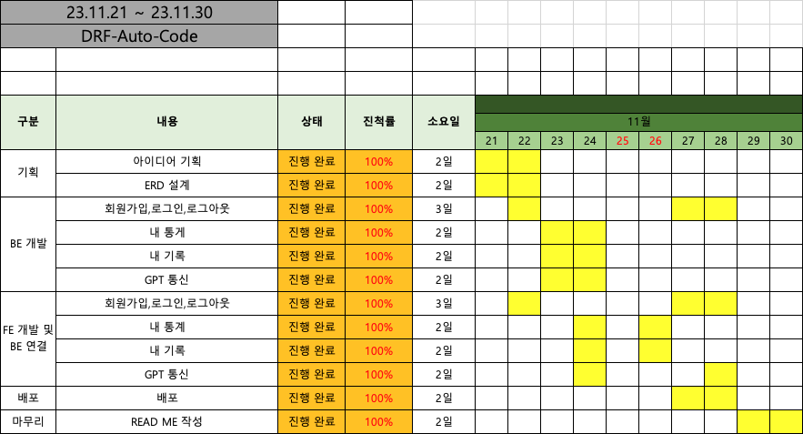
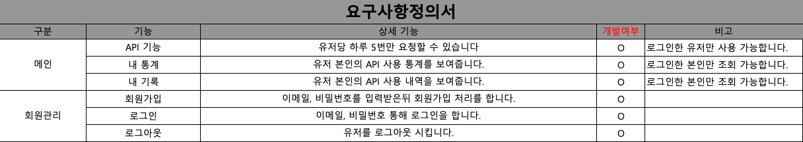
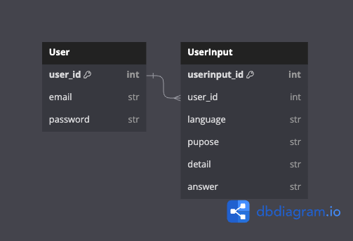
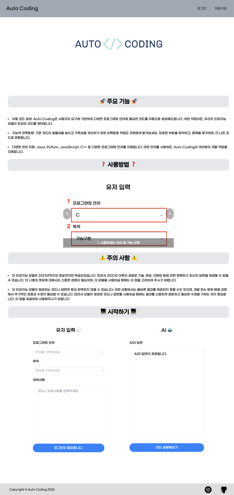
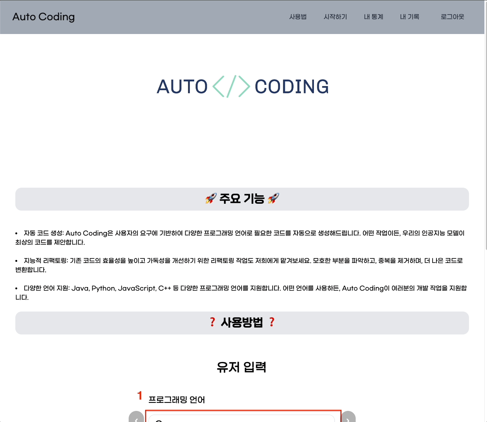
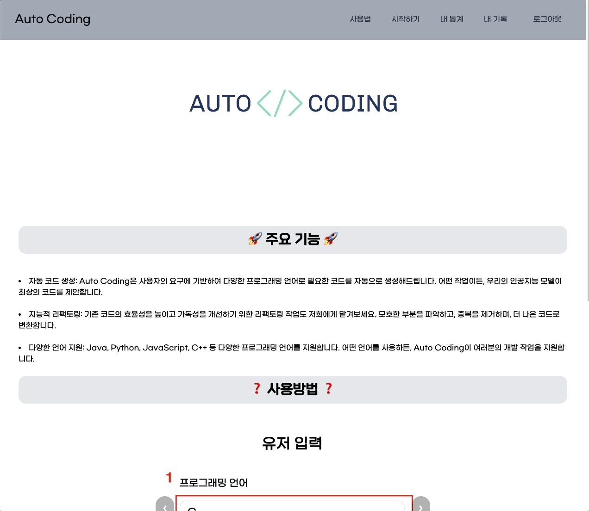
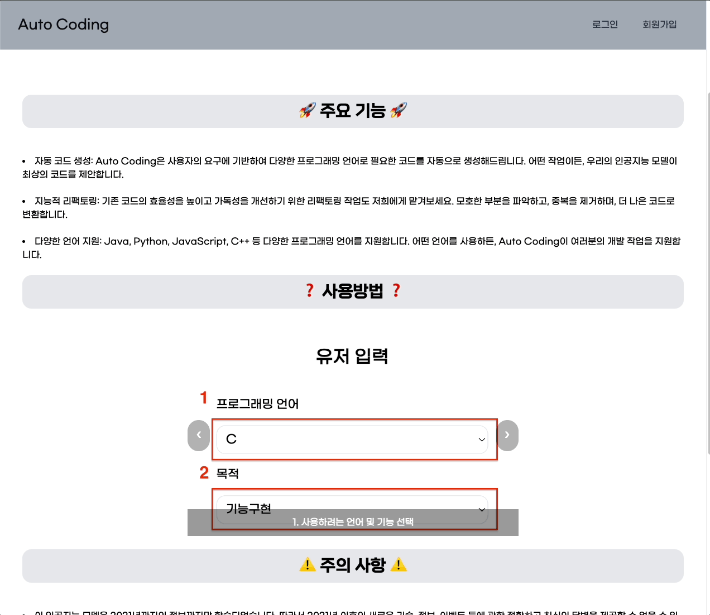
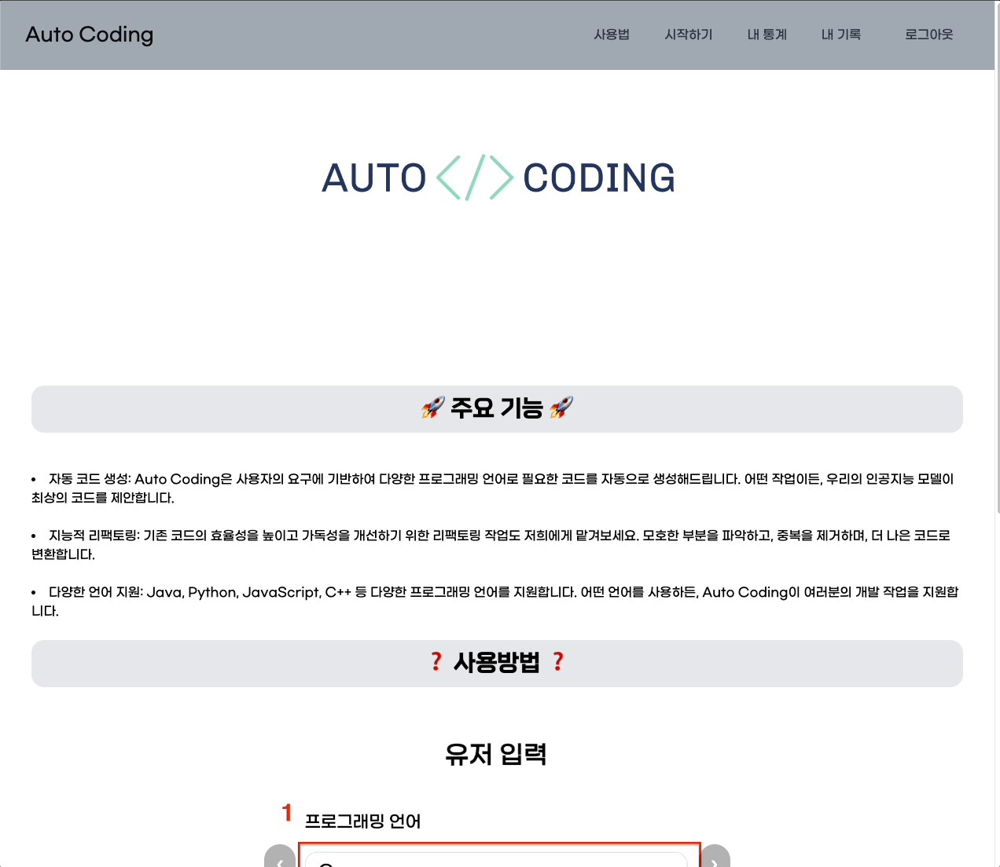

<div align='center'>

# DRF-Auto-Code

</div>
<div align="center">


</div>

## Auto-Code-Django

- 1차 개발기간: 23.08.29 ~ 23.09.06 (9일)

- 2차 개발기간: 23.11.21 ~ 23.11.28 (8일)

---

## 목차 📝

1. [프로젝트 소개](#summary)

2. [배포 URL](#url)

3. [프로젝트 일정](#planning)

4. [요구사항 분석](#requirement)

5. [기술 스택](#stack)

6. [프로젝트 구조](#tree)

7. [ERD 설계](#erd)

8. [상세 페이지 설명](#main-exe)

9. [겪었던 에러들](#errors)

10. [느낀점](#impression)

---

## <span id="summary"> 프로젝트 소개 🙇‍♂️

Auto-Coding은 AI가 코드를 대신 작성해 주는 서비스입니다.

이번 프로젝트는 이전 프로젝트에서 개발한<a href="https://github.com/HiImYong99/Auto-Generate-Code"> Auto-Coding</a>을 기반으로, 
Django REST Framework을 활용하여 회원가입, 로그인, 로그아웃 기능이 추가되었습니다. 

또한, OpenAI에서 제공하는 API를 이용하여 직접 만든 서버를 통해 요청하도록 했습니다.

유저들은 이제 각각의 요청값과 응답값을 데이터베이스에 안전하게 저장하고, 이를 통해 로그인한 본인만이 해당 정보를 확인할 수 있습니다.
  
이를 통해 보안과 개인 정보의 안전한 관리가 가능합니다.

---

## <span id="url">배포 URL 🔗

> **🔗 : <a href="http://d3n3wr5yyqfyke.cloudfront.net/index.html" target="_blank"> Auto Coding 바로가기</a>

```
해당 서비스를 이용할 수 있는 테스트 계정입니다.
ID : test1@gmail.com
PW : test2023
```
 - Front-End Repo: https://github.com/HiImYong99/DRF-Auto-Code-FE

---

## <span id="planning"> 프로젝트 일정 🗓️

 

---

## <span id="requirement"> 요구사항 분석 🧐



<a href='#main-exe'>기능 시연 화면</a>

---

## <span id="stack">기술 스택📚

### Environment


### Development

- #### FrontEnd


<br>

- #### BackEnd


- #### DBMS


- #### API


- #### 배포


---

## <span id="tree">프로젝트 구조 🏛️

### URL 구조🌐


#### main
|이름|URL|Method|
|------|---|---|
|랜딩페이지|gpt/||
|내 기록|request/||
|내 기록|request/||
|내 기록|request/||
|내 기록|request/||
|내 기록|request/||

#### accounts
|이름|URL|Method|
|------|---|---|
|로그인|accounts/login/|POST|
|로그아웃|accounts/logout/|POST|
|회원가입|accounts/register/|POST|


 
### 폴더 트리🌳
``` tree
📦 DRF_Auto_Code

├─ 📂 DRF_Auto_Code
│  ├─ __init__.py
│  ├─ asgi.py
│  ├─settings.py
│  ├─ urls.py
│  └─ wsgi.py
├─ 📂 accounts
│  ├─ __init__.py
│  ├─admin.py
│  ├─apps.py
│  ├─managers.py
│  ├─ migrations
│  ├─ models.
│  ├─tests.py
│  ├─ urls.py
│  └─ views.py
├─ 📂 main
│  ├─ __init__.py
│  ├─admin.py
│  ├─apps.py
│  ├─ migrations
│  ├─ models.py
│  ├─serializers.py
│  ├─tests.py
│  ├─ urls.py
│  └─ views.py
├─ manage.py
└─ requirements.txt
```

---

## <span id="erd"> ERD 설계 📀


---


## <span id="main-exe">상세 페이지 설명  🚨

### 메인 페이지

|               메인 페이지               |
| :-------------------------------------: |
|   |

#### ⭐️ 

- 

#### ⭐️ 

- 이메일과 비밀번호를 통한 로그인을 할 수 있습니다.


<br>

### 회원관리

<br>


|                회원가입               |
| :-------------------------------------: |
|  |

```
이메일과 비밀번호를 통한 회원가입 할 수 있습니다.

회원가입 로그인 완료 시 로그인 페이지로 이동합니다.
```

|                 로그인               |
| :-------------------------------------: |
|  |

```
이메일과 비밀번호를 통한 회원가입 및 로그인을 할 수 있습니다.

로그인 완료 시 메인페이지로 이동합니다.

로그인을 한 유저는 메인 서비스를 이용할 수 있습니다.
```

<br>

|                 로그아웃                 |
| :-------------------------------------: |
|   |

```
로그아웃 버튼을 통해 유저는 로그아웃을 할 수 있습니다.

로그아웃 완료 시 메인페이지로 이동합니다.
```

<br>

|                 자동 로그아웃                 |
| :-------------------------------------: |
|   |

```
사용자가 30분 동안 가만히 있으면 사용자는 자동으로 로그아웃이 됩니다.

로그아웃 완료 시 메인페이지로 이동합니다.
```

<br>


### 메인 서비스

<br>


|              자동 코드 생성             |
| :----------------------------------: |
|   |

```
사용자가 선택한 option과 입력한 세부내용들을 요청버튼을 클릭하여 AI에게 데이터를 요청합니다.

이때 사용자가 요청 버튼을 클릭하면 요청한 내용들은 DB에 저장됩니다.

AI의 응답이 완료되면 응답 받은 내용을 html 문서에 출력합니다. 

이때 출력한 내용 또한 DB에 저장됩니다.
```

<br>

|              요청 횟수 제한             |
| :----------------------------------: |
|   |

```
사용자는 하루 최대 5건의 요청만 가능합니다.

하루 5건의 넘는 요청을 할 시 사용자에게 alert가 나타나며 AI의 응답은 출력되지 않습니다.
```

|              접근제한             |
| :----------------------------------: |
|   |

```
자동 코드 생성 서비스는 로그인을 한 유저만 사용 가능하며 

비회원 유저에게는 요청 버튼이 아닌 로그인 페이지로 이동하는 버튼이 나타납니다.
```

<br>

<br>

|      내 통계       |
| :-------------------------------------: |
|   |

```
메인 페이지를 벗어나지 않고 모달 창을 이용하여 편리하게 사용자의 통계를 확인할 수 있습니다.

위 통계는 각 사용자가 AI에게 요청할 때 저장된 DB를 통해 나타난 수치이며 로그인한 본인만 확인할 수 있습니다.
```

<br>

|               내 기록                |
| :------------------------------------: |
|   |

```
이전에 AI에게 요청했던 세부내용들과 AI에게 답변 받은 내용들은 '내 기록' 페이지에서 언제든지 확인할 수 있습니다.

위 기록 또한 사용자가 AI에게 요청할 때 입력한 내용과 AI가 답변할 때 DB에 저장된 내용을 기반으로 사용자들에게 보여집니다.

기록을 삭제하고 싶다면 삭제 아이콘을 클릭하여 원하는 데이터를 삭제하거나

기록초기화 버튼을 클릭하여 DB에 저장된 요청 관련 데이터들을 모두 삭제 시킬 수 있습니다.
```


<br>


---

## <span id="errors">겪었던 에러들 😑
 

<br>

___

## <span id="impression">개발하며 느낀점 🧑‍💻

### 배운점 ✏️


### 느낀점 ✍️

---
<a href='#'>⬆️ 맨 위로 ⬆️ </a> 